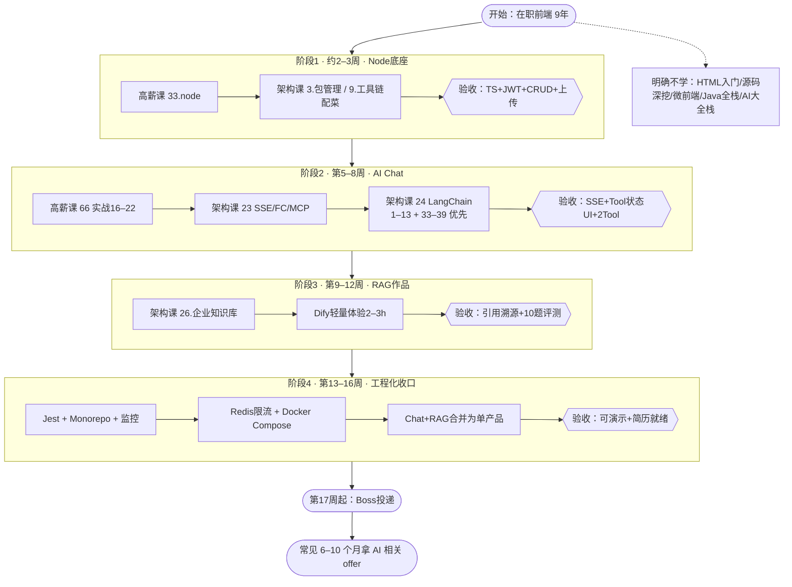
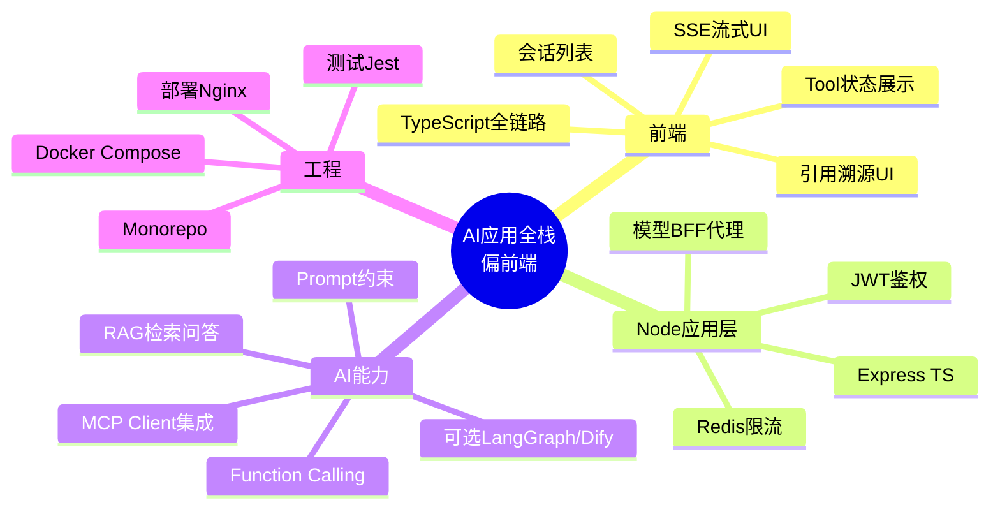

# 前端 → AI 应用全栈：学习路线图

> **本文档 = 学习上下文包。** 文件在仓库 `plan/` 目录下。新开 Agent 时发 **`@plan/LEARNING_PLAN.md` + `@plan/menu.md`**：前者是背景与计划，后者是渡一完整课表。  
> 用法：按阶段往下勾；每阶段「验收」不过，不进入下一阶段。

---

## Agent 续聊说明（给新对话的 AI）

读本文后你应知道：

1. **用户是谁** → 见下「个人背景」
2. **目标岗位** → AI 应用全栈 **偏前端**（Node BFF + 流式 UI + RAG），**不是**算法岗、**不是** Java 业务 CRUD 全栈
3. **已购课程** → 渡一 **高薪课 + 架构课**；**明确不买** AI 大全栈；完整课表见 **`plan/menu.md`**
4. **学习主线** → 四阶段；执行日历：**通勤看课（约 1h/天 · 1.7x）+ 岗位半天写码 + 周末两个半天**。**34 博客不跟做**（卡住再查）；阶段末缓冲保留；作品后 **单独** React + 八股，约 **第 14～16 周试投**
5. **作品素材** → 骑行博主，RAG 用 `plan/daihuo.md` / `plan/rchang.md`
6. **当前状态** → 见文末「当前进度」；阶段 1 尚未开始编码
7. **技术栈已定死** → 前端 **Vue3 + TS**，向量库 **Qdrant**（理由见「技术栈约定」）
8. **短板已复盘** → 见「短板与补足清单」10 条（React 补课、编排画布、性能数字、八股、公网部署等），**都有对应课程章节**，别再推荐新课
9. **薪资预期** → 见「求职对齐」分场景表：正常场景 **30–40K**，50K+ 卡 985/211 短期不追
10. **学习方式** → 见「怎么学：Cursor vs 手写」：核心链路必须能空手重写；CRUD/配置可生成但要读懂。**不要建议全程手写或全程生成**

**不要建议用户：** 买 AI 大全栈、买马士兵等 Python 大模型大包、All-in 转 Java 全栈、转算法/训模型、学 React（已定 Vue3）、跟做高薪 34 博客整项目、回头学 HTML/算法题海/源码长线（除非用户改口）。

---

## 个人背景与目标


| 项        | 内容                                                                                                |
| -------- | ------------------------------------------------------------------------------------------------- |
| 基本信息     | 男，**1994-10**，**北京**，32 岁                                                                         |
| 学历       | 二本                                                                                                |
| 工作       | **前端 9 年**（2017 至今），主业偏 **CRUD / 业务页**                                                            |
| 已有亮点     | 上家 **带过 3 人前端小组**、**主导攻坚项目**、**小程序 0-1 独立开发**、**带过实习生**（简历与面试的「带人 / Owner / 0-1」证据）               |
| 职级参照     | 上家 **P5（高级，约 5 年前）**；现公司体系 P5–P6 = 高级、P7–P8 = 资深，**自评 P6**（职级事项与学习计划并行，不在本文展开）                    |
| 其他经历     | 约 **2 年 Android**；现公司技术栈含 **Java 后端**（仅工作联调，不单独转型）                                                |
| 副业       | **公路车博主**（收入/资产细节不记入本文）                                                                                |
| 焦虑       | 32 岁仍偏 CRUD，担心 35 岁可替代性                                                                           |
| **转型目标** | **AI 应用全栈 · 偏前端**：流式对话 UI、Tool/RAG 展示、Node BFF 代理模型；**不训模型、不做算法**                                 |
| 大厂期望     | 阿里/京东等有机会但非轻松路径；先拿 AI 相关 offer，大厂可能 12–18 个月                                                      |
| 学习时间     | 通勤单程 **1.5h**（往返 3h），其中约 **1h 看视频 · 1.7 倍速**；岗位上几乎每天能抽 **半天写代码**（不能看课）；周末 **两个半天**。详见「每周节奏 / 怎么学」 |


### 已做过的关键决策（勿反复推翻）


| 决策                       | 结论                             | 理由                                                                                                       |
| ------------------------ | ------------------------------ | -------------------------------------------------------------------------------------------------------- |
| 买不买 AI 大全栈               | **不买**                         | 架构课已有前端+AI、LangChain、LangGraph、企业知识库；大全栈大量「待定」且偏 Python/Java/运维                                          |
| 是否转 Java 全栈              | **不 All-in**                   | 解决不了「32 岁还 CRUD」；现公司 Java 联调即可                                                                           |
| 课程主线                     | **高薪 33/66 + 架构 23/24/26**     | 对齐 Boss「AI 应用前端 / 前端全栈 AI」JD                                                                             |
| 高薪 34 博客课                | **不跟做整项目**                     | 博客 CMS 与骑行笔记+Chat+RAG 不是同一条线；33 足够撑阶段 1。卡住时查 34 的 4～6、10～13 讲即可                                          |
| 视频领先代码                   | **课领先写码 0.5～1 天**              | 岗位半天码力很足，没听过的模块禁止靠 Cursor 开新功能                                                                           |
| 简历定位                     | **资深前端 · AI 应用落地**             | 9 年经验不写「刚学 AI 的新人」                                                                                       |
| 马士兵等 Python 大包（AI大模型无忧班） | **不买、不 All-in**                | 主栈 Python + 算法/微调/训模型 + 夹大数据与办公自动化，约 2000 小时；与「AI 应用前端」JD 不对口。同事 Java 后端半年转成，是「后端 + 挑课 + 公司项目」，不适用 9 年前端 |
| 是否系统学 Python             | **不列入主线**                      | Node BFF + 架构课已覆盖 RAG/Agent；仅当目标 JD 明确要求时，单独补一个 Python RAG Demo                                          |
| 前端主栈                     | **Vue3**（不学 React）             | 与公司主栈一致；AI 岗 Vue/React 都有招                                                                               |
| 向量库                      | **Qdrant**                     | TS SDK + 单镜像部署 + 可讲生产选型；理由见「技术栈约定」                                                                       |
| Cursor vs 手写             | **核心链路必须能空手重写**；CRUD/配置可生成但要读懂 | 纯生成面试口述不出来；岗位半天码力足，更要防「功能有了讲不清」。详见「怎么学：Cursor vs 手写」                                                     |


---

## 项目资产（本仓库）

```text
Agent/
├── README.md                 # 仓库说明
├── plan/                     # 学习计划与语料（本文所在目录）
│   ├── LEARNING_PLAN.md      # 背景 + 学习计划 + 进度 + 求职
│   ├── menu.md               # 渡一完整课表
│   ├── daihuo.md             # RAG 语料（骑行带货/装备）
│   └── rchang.md             # RAG 语料（骑行相关）
├── chche/                    # 空目录（用途待定；若是缓存建议改名 cache/）
└── apps/                     # 阶段 1 起再建：api + web（尚未创建）
```

| 路径 | 用途 |
| --- | --- |
| `[LEARNING_PLAN.md](./LEARNING_PLAN.md)` | 本文 |
| `[menu.md](./menu.md)` | 渡一三门课完整目录（同目录相对链接仍可用） |
| `[daihuo.md](./daihuo.md)` / `[rchang.md](./rchang.md)` | RAG 语料；代码里引用写 **`plan/daihuo.md`**、**`plan/rchang.md`** |
| `../README.md` | 仓库根说明 |
| `../apps/api` · `../apps/web` | 后续 Monorepo 代码位置（相对本文件） |

**计划中的产品：** 骑行笔记 CRUD（阶段 1）→ AI Chat（阶段 2）→ 骑行知识库 RAG（阶段 3）→ 合并为单产品演示（阶段 4）。

---

## 已购课程（速查 · 详细章节见 menu.md）


| 课程包        | 状态   | 官网链接                                                                                                                                                                   | 门数  |
| ---------- | ---- | ---------------------------------------------------------------------------------------------------------------------------------------------------------------------- | --- |
| **高薪课**    | ✅ 已购 | [https://app.duyiedu.com/toc?productId=964f6d7e-e758-4c57-8740-08206b682710](https://app.duyiedu.com/toc?productId=964f6d7e-e758-4c57-8740-08206b682710)               | 66  |
| **架构课**    | ✅ 已购 | [https://app.duyiedu.com/toc?productId=44353a96-2deb-4ae5-be4d-143fe03f692b](https://app.duyiedu.com/toc?productId=44353a96-2deb-4ae5-be4d-143fe03f692b)               | 32  |
| **AI 大全栈** | ❌ 未购 | [https://app.duyiedu.com/toc-detail?productId=54a002b2-1227-4207-9aed-e75be9cdb590](https://app.duyiedu.com/toc-detail?productId=54a002b2-1227-4207-9aed-e75be9cdb590) | 24  |


★ 本计划主课：高薪 **33 / 66** · 架构 **1 / 3 / 9 / 13 / 23 / 24 / 26 / 28**（**34 仅查阅**；章节速查见下，完整标题见 `[menu.md](./menu.md)`）

---

## 本计划涉及的课程 · 章节速查

> 查某一讲完整标题 → `[menu.md](./menu.md)` 搜「#### 序号. 课程名」

### 高薪课 33 · node（阶段 1）

`1.Node核心` 1.1–1.14 · `2.Mysql` 2.1–2.8 · `3.数据驱动和ORM` 3.1–3.12 · `4.express` **4.1–4.18 重点**（4.19–4.26 场景可选） · `5.补充` 5.1–5.2 websocket/socket.io

### 高薪课 34 · 个人博客服务端设计（**不跟做**，仅查阅）

整门 **不当交付**。卡住 Express 分层/JWT/上传时，按需搜：`4` 错误处理 · `5–6` token · `10` 上传 · `11–13` CRUD 对照。

### 高薪课 66 · AI技术认知和效能工具（阶段 2）

1 课程结构 → 15 Vibe Spec Coding（概念可快过） · **16–22 实战**（工程骨架 / API 文档 / 多分支 / e2e / 前端测试 / **会话服务端 / 会话前端**）

### 高薪课 41 · Egg（阶段 4，仅部署）

**只看 `1.11.部署`**；框架 1.1–1.10 可不学（已有 Express）

### 架构课 3 · 企业级包管理（阶段 1 配菜 / 阶段 4）

1 npm 回顾 → **8 搭建 monorepo 工程**（9–11 阶段 4 再看）

### 架构课 9 · 前端工具链（阶段 1 配菜）

**3 ESLint + 2 Prettier**（3.10 ESLint+Prettier 实战）

### 架构课 23 · 前端+AI 基础篇（阶段 2）

**必看：** 3.11–3.18 流式/上下文/DeepSeek/FC · **3.29–3.31** SSE/StreamableHTTP/MCPClient · 3.32–3.37 幻觉与提示词  
**阶段 3 再补：** 3.38–3.41 RAG 入门 · 3.19–3.28 MCP 深入（可选）

### 架构课 24 · LangChain（阶段 2–3）

**阶段 2 必做：** 1–13 模型/LCEL/流式 · **33–39** Tools/Agent  
**阶段 3 补：** 19–27 RAG 练习 · 28–31 Memory（可选）

### 架构课 26 · 企业知识库（阶段 3）

1.1–12.3 全讲：RAG Pipeline / Chunking / Embedding / 向量库 / Hybrid·Rerank / Grounding / **Eval**

### 架构课 28 · AI平台篇（阶段 3，轻量必做 2–3h）

**21 Dify 基本介绍** + **25 本地部署 Dify**（或 17 知识库相关节）

### 架构课 1 · 前端测试框架（阶段 4）

Jest 2.1–2.6 · 测组件 3.6/3.7/3.9 · **5.1 测 Express**

### 架构课 13 · 前端服务监控（阶段 4，薄学）

1 概述 → 9 api 远程请求数据采集（前几讲够简历用）

### 补足项相关课程（详见「短板与补足清单」）

**高薪课 25 · Vue3（新）** — `4.26–4.28` 虚拟列表+优化 · `4.30` vuedraggable · `4.31` vue-drag-resize · `4.24` 防抖 · `4.25` 懒加载  
**高薪课 29 · 新版React** — `1.1–1.7` 核心+Hooks · `2.1–2.7` router/redux（3/4 章项目可跳）  
**高薪课 61 · BPMN可视化与工作流实践** — 1–20 全（bpmn.js、自定义 Palette/Modeler/renderer/ContextPad/PropertiesPanel、flowable）  
**高薪课 62 · 低码平台实战项目** — `13–17` 搭编辑器 / 往画布添加组件 / 编辑 / vuedraggable / 拖动画布  
**高薪课 60 · 大屏数据可视化** — `5–12` 柱状/折线/Chart封装/地图 · `14–15` WebSocket 取数  
**高薪课 19 · Canvas详细版** — 全（仅当 JD 明确要 Canvas 底层）  
**八股（投递前 2 周）** — `58. vue3就业强化` 全 · `54. 浏览器就业强化` `1/8/18` · `55. 网络就业强化` `15/17/18/19/24/25` · `52. JavaScript就业强化` · `53. Promise就业强化`  
**架构课 30 · 企业级文档协同** — `12.1–12.3` LlamaIndex · `14.3` 流式响应与引用生成 · `**15.1` 简历书写指导 · `15.2` 面试问题指导**

### 架构课 16 · NestJS（可选）

Express 撑不住再学：模块/守卫/JWT/上传/WS

### 架构课 25 · LangGraph（可选）

**2.1–2.17** 工具调用与流式

### 架构课 27 · Coding Agent（可选，冲大厂）

整门，作品完成后

---

## 怎么用这份文档


| 方式                        | 作用                      |
| ------------------------- | ----------------------- |
| **Agent 续聊说明** + **个人背景** | 新对话时给 AI 读，免重复介绍        |
| `[menu.md](./menu.md)`    | 渡一完整课表，查具体章节标题          |
| **本计划章节速查**               | 仅列计划用到的课；详细章节见 menu.md  |
| 下面的**流程图**                | 看清先后顺序，避免乱学             |
| 各阶段**勾选清单**               | 每天/每周对着打勾               |
| **求职对齐**（文末）              | Boss 关键词、简历 bullet、投递时间 |


建议：把本文和 `[menu.md](./menu.md)` 并排打开。

---

## 怎么学：Cursor vs 手写（定死，别两头走极端）

**原则：** 纯 Cursor 生成、自己不理解 → 面试口述不出来、出 bug 调不了，**好处不多**。  
但也不必全部手写。目标不是默写 Express 语法，而是**每个阶段的核心链路能空手在白板上画出来，并解释每个环节为什么这么做**。课用来建这张图，语法有 Cursor。

### 分层（什么进脑子、什么让它写）


| 层级               | 内容                                                                                                                                                   | 标准                    |
| ---------------- | ---------------------------------------------------------------------------------------------------------------------------------------------------- | --------------------- |
| **必须能自己重写一遍**    | 阶段 1：请求进 Express → 中间件 → JWT → 落库 → 错误冒泡；阶段 2：**SSE 每一行**（ReadableStream 怎么读、Abort 怎么传到后端、渲染为什么要节流）；阶段 3：RAG 每步的决策（chunk 大小、为何 rerank、Grounding 卡在哪） | 关掉 Cursor，从空文件能写出核心路径 |
| **可以生成，但必须逐行读懂** | CRUD 接口、ORM 模型、路由、Vue 组件骨架                                                                                                                           | 能指出「这段在干什么、错了会怎样」     |
| **放心生成、不深究**     | 测试用例、类型定义、Docker/compose、ESLint、README、正则                                                                                                            | 能跑即可                  |


**别搞反：** 阶段 1 底座最不该偷懒；阶段 4 工程化配置反而可以大胆生成。

### 推荐循环（每周至少对核心链路做一次）

1. **先自己写一版（哪怕丑），再让 Cursor 改**——它改哪里 = 你缺什么。反过来「它写你读」第二天忘光。
2. **它写完能跑之后：关掉窗口，从空文件重写核心段。** 写不出来的地方就是没懂的地方。阶段 2 的 SSE 值得做 3～4 次。
3. **故意制造 bug 去调：** 注释掉 AbortController 看会不会继续烧 token；打开 Nginx `proxy_buffering` 看流式怎么卡住。
4. **每次生成后问一句「为什么不是另一种写法」**，答不上来就追问到能复述。

### 面试要能讲的那句（补足 #8 的验收标准）

> 全程用 Cursor，效率大约一半，但 SSE 中断逻辑它写不对——没把 AbortController 的 signal 传到后端，点停止后还在烧 token，我重构了这一段。

同时证明：会用 AI 工具、懂 SSE、有成本意识。比「全手写不用 AI」和「用 Cursor 写完了」都强。

---

## 技术栈约定（定死，别两头兼顾）


| 层    | 选择                              | 说明                                                |
| ---- | ------------------------------- | ------------------------------------------------- |
| 前端   | **Vue3**（已定，跟公司主栈一致）            | 阶段 1–3 **不碰 React**；作品完成后再补 React 到「能读能改」（见补足 #1） |
| 前端语言 | **TypeScript**                  | 组件、Composable、API 类型全覆盖                           |
| 后端   | **Node + Express + TypeScript** | BFF 代理模型；Key 永不放前端                                |
| 数据库  | MySQL + **Redis**（阶段 4 加）       | Redis 做限流/会话缓存                                    |
| 向量库  | **Qdrant**（已定）                  | 官方 TS SDK、单镜像 Docker、可说是生产选型                      |


**向量库选型理由（面试可直接讲）：** Qdrant 单二进制 / 一个 Docker 镜像，运维成本低，有官方 TypeScript SDK，LangChain.js 支持完善，百万～亿级都够用。  
**要能口述取舍：** Chroma 只适合原型（百万级以上性能不行）；pgvector 适合「已有 PostgreSQL、想少一个组件」，但本项目主库是 MySQL；Milvus 是亿级分布式方案，要背 etcd + MinIO + 消息队列的运维复杂度，本项目规模用不上。  
**若目标 JD 明确写 Milvus：** 用 Milvus Lite / Standalone 把同一份 RAG 代码换个 adapter 跑通即可（2–3 小时），不必提前学分布式部署。

**简历定位（9 年经验）：** 不写「刚学 AI 的新人」，写 **「资深前端 · AI 应用落地」**——强调独立交付、复杂业务、全链路把 AI 做成产品。

---

## 短板与补足清单（对 JD 复盘后新增）

> 主线四阶段不变。这一节是**决定薪资档位**的补丁：真实 JD 里高频出现、但原计划没覆盖的东西。
> 好消息：除 Vue Flow 外，**全部能在已购课里找到章节**。


| #   | 短板                         | 为什么要补（JD 依据）                                                                              | 对应课程章节                                                                                                                                                      | 什么时候做                                 |
| --- | -------------------------- | ----------------------------------------------------------------------------------------- | ----------------------------------------------------------------------------------------------------------------------------------------------------------- | ------------------------------------- |
| 1   | **Vue3 在 AI 岗覆盖率低于 React** | 淘天「精通 React 及生态」、AI应用方向岗「React/Next.js」；但滴普「Vue 或 React」、点点「至少一种」、京东「框架不限」→ Vue 能投约 6–7 成 | 高薪 **29. 新版React** `1.1–1.7` + `2.1–2.7`                                                                                                                    | **第 14～15 周单独排**（阶段 4 之后）。阶段 1–3 绝不分心 |
| 2   | **可视化 / 拖拽编排画布**           | AI应用方向岗把「做过画布、图编辑器、拖拽编排」写进**硬要求**；淘天要「Agent 可视化编排平台」；Coze/HiAgent 方向同理                    | 高薪 **61. BPMN可视化与工作流实践**（bpmn.js 自定义 Palette/renderer/PropertiesPanel）· **62. 低码平台实战** `13–17` · **25. Vue3（新）** `4.30 vuedraggable` `4.31 vue-drag-resize` | 阶段 3 末 或 阶段 4                         |
| 3   | **AI 场景性能优化（要有数字）**        | 淘天「Virtual DOM/Diff/渲染流程 + 定位性能问题」「流式渲染稳定性、弱网」；AI应用方向岗「虚拟化渲染、Web Worker、大数据量」             | 高薪 **25. Vue3（新）** `4.26–4.28 虚拟列表` · **54. 浏览器就业强化** `18 web worker` · **58. vue3就业强化** `21 Vue项目性能优化`                                                     | **阶段 2 顺手做**，记录前后数据                   |
| 4   | **前端八股会生疏**                | 9 年 CRUD 后浏览器原理/diff/网络大概率答不利索，AI 前端岗照样考技术面                                               | 高薪 **58. vue3就业强化**（全）· **54. 浏览器就业强化** `1/8/18` · **55. 网络就业强化** `15/17/18/19/24/25` · **52/53** JS+Promise                                                | **第 16 周集中刷**，刷完再试投                   |
| 5   | **学历硬门槛（二本）**              | 滴普「985/211，能力突出可放宽」；猎聘 50–80K「必备 985/211 + 大厂大模型经验」                                       | 无法补 → **靠作品和 9 年年限绕过**；50K+ 那档短期不投                                                                                                                          | 认清预期，不投卡死学历的岗                         |
| 6   | **线上可访问 demo（不只是仓库）**      | 面试官点开就能用 ≫ 让他 clone 下来跑；你有骑行博主流量，能拿到「有真实用户」的故事                                            | 高薪 **41. Egg** 仅 `1.11 部署` + 架构 **13. 前端服务监控**                                                                                                              | 阶段 4，**必须真部署公网**                      |
| 7   | **token / 成本意识**           | 和硕 Agent 岗要求「能 profile 一个 workflow 用了多少 token、哪段浪费」                                       | 无专门课 → 自己做埋点 + Redis 统计                                                                                                                                     | 阶段 4，产出一句「加缓存后单次问答成本从 X 降到 Y」         |
| 8   | **Cursor 使用经验要前移**         | 淘天、AI应用方向岗把「熟练使用 AI 编程工具并把控生成代码质量」写进**任职要求**，不是加分项                                        | 高薪 **66** `9–15` 相关讲                                                                                                                                        | **从阶段 1 第一行代码就用**，并记录它写错了什么           |
| 9   | **简历/面试话术没人指导**            | —                                                                                         | 架构 **30. 企业级文档协同** `15.1 简历书写指导` `15.2 面试问题指导`（原计划漏了这两讲）                                                                                                    | 阶段 4 末，1 小时                           |
| 10  | **Vue Flow 节点编排**          | 唯一课里没有的 → 看官方文档，`@vue-flow/core` 2–3 天出可拖可连线的 demo                                        | 官方文档                                                                                                                                                        | 阶段 3 末（与 #2 二选一或都做）                   |


**优先级：** #3 #8 是顺手就做、零额外成本，必做。#2 #6 最能拉开薪资档位。#1 #4 在投递前集中处理。#5 是认预期，不是补课。

---

## 总览路线图




---

## 能力导图（你最终要具备什么）




---

## 阶段 1：Node 底座（约 2–3 周）

**目标：** 能独立写 TypeScript 后端 API（跳槽 / BFF / AI 代理的底座）

### 学什么（对照 menu.md）

- [ ] **高薪课 → 33. node**
  - [ ] `1.Node核心`（模块/HTTP/文件流）
  - [ ] `2.Mysql`
  - [ ] `3.数据驱动和ORM`（Sequelize）
  - [ ] `4.express`（重点：中间件、CORS、JWT、上传 `4.1–4.18`）
  - [ ] `5.1–5.2` websocket / socket.io（了解即可，阶段 2 主用 SSE）
- [ ] **高薪课 → 34**：**不跟做**；JWT/上传/分层卡住时按需查阅
- [ ] **架构课 → 3. 企业级包管理方案**（`1–8`，建仓库时看）
- [ ] **架构课 → 9. 前端工具链**（ESLint + Prettier，配规范时看）

### 实践交付

- [ ] Monorepo 雏形（仓库根目录）：`apps/api`（**TS + Express**）+ `apps/web`（**Vue3 + TS**）
- [ ] 骑行笔记：注册登录（JWT）+ CRUD + 上传
- [ ] Vue3 页面能调通接口（列表 / 详情 / 新建）

### 阶段验收

- [ ] Postman 跑通登录与 CRUD
- [ ] 能口述：请求 → 中间件 → Token → 落库
- [ ] **空手白板：** 画出一次登录请求的完整路径（含中间件顺序、JWT 验签失败怎么返回、错误怎么冒泡）；不看代码能讲清
- [ ] `api` 目录已是 TypeScript 编译运行
- [ ] 已开始用 Cursor，并记下至少 1 处它写错、你改对的例子（补足 #8，阶段 1 就启动）

---

## 阶段 2：AI Chat（约 3–4 周）

**目标：** SSE 流式对话 + Tool 状态 UI + 会话落库（对齐 Boss「AI 应用前端」JD）

> **减负原则：** LangChain 章节完成度 < Chat 项目可演示度。RAG 细讲放到阶段 3 跟架构 26 一起学。

### 学什么（按优先级）

**必做（面试够用）：**

- [ ] **全程用 Cursor 写代码（补足 #8）**：从阶段 1 就开始，本阶段起**记笔记**——哪些活它干得好、哪段（如 SSE 错误边界、abort 逻辑）它写错了、你怎么改的。面试要能讲出这个，而不是只说「我会用 Cursor」
- [ ] **高薪课 → 66. AI技术认知和效能工具**
  - [ ] `1–15` 建立概念（可 1.5 倍速）
  - [ ] **重点** `16–22` **实战**（工程骨架 → 会话服务端/前端）
- [ ] **架构课 → 23. 前端+AI（基础篇）**
  - [ ] **必看** `3.11–3.18` 流式 / 上下文 / DeepSeek / FunctionCalling
  - [ ] **必看** `3.29–3.31` SSE / StreamableHTTP / **MCPClient**
  - [ ] `3.32–3.37` 幻觉与提示词
- [ ] **架构课 → 24. LangChain**
  - [ ] **必做** `1–13` 模型 / 提示词 / LCEL / 流式
  - [ ] **必做** `33–39` Tools / Agent

**阶段 3 再补（本阶段可不勾）：**

- [ ] `3.38–3.41` RAG 入门 → 阶段 3 前置
- [ ] `19–27` Loader / 切割 / 向量 / RAG 练习 → 跟架构 26 合并学
- [ ] `28–31` Memory → 会话落库已有可后补

### 实践交付

- [ ] 项目 A：AI Chat（**模型 Key 只在后端 BFF**）
- [ ] **SSE 流式输出** + 停止生成
  - [ ] 前端用 `**fetch` + `ReadableStream**` 消费流（不用 `EventSource`：它不支持 POST 和自定义 Header）
  - [ ] 用 `**AbortController**` 实现「停止生成」与超时，避免后台继续烧 token
  - [ ] token 洪峰时做渲染节流（`requestAnimationFrame` 或定时合并），半截 JSON 不解析不崩
- [ ] ≥ 2 个 Tools + **Tool 状态 UI**（调用中 / 成功 / 失败 / 结果）
- [ ] 模型**超时 / 失败**时有友好提示，可重试
- [ ] 多轮会话落库（MySQL）
- [ ] **性能优化（补足 #3，顺手做，必须留数字）**
  - [ ] 消息列表**虚拟滚动**（高薪 25 `4.26–4.28`）：记录「500 条消息滚动帧率 从 X → Y」
  - [ ] Markdown 流式渲染时**未闭合代码块降级**，不闪不崩
  - [ ] 测一次 **首字延迟 TTFT**，写下优化前后数字
- [ ] **MCP 最小集成**：用 MCP Client 接 1 个 Tool（如读本地 Markdown 或查笔记 API）
- [ ] 1 分钟演示录像

### 阶段验收

- [ ] 别人按 README 能本地跑起来
- [ ] 能口述 SSE 与 WebSocket 在本项目里的选型理由
- [ ] **空手白板 + 空文件重写：** 画出 SSE 全链路（前端 fetch/ReadableStream → BFF → 模型 → 推流；Abort 信号怎么传到后端；半截 JSON 怎么处理）；**关掉 Cursor 能从空文件写出这段核心代码**
- [ ] 有一条可讲的 Cursor 翻车记录（如 abort 没传到后端、Nginx 缓冲吃掉流式）

---

## 阶段 3：RAG 作品（约 3–4 周）

**目标：** 骑行知识库问答（`plan/daihuo.md` / `plan/rchang.md`），带引用溯源与简单评测

### 学什么

- [ ] **架构课 → 26. 企业知识库**（建议整门 1–12 讲）
  - 至少吃透：Chunking / Embedding / 向量库 / Pipeline / Hybrid·Rerank / Grounding / **Eval**
- [ ] 补 **架构课 24** `19–27` RAG 练习（若阶段 2 未做）
- [ ] **架构课 → 28. AI平台篇（扣子&Dify）**：**轻量必做 2–3 小时**，搭一个同款 RAG 原型（简历可写「熟悉 Dify 工作流」）

### 可选加深（有余力再勾）

- [ ] **公司内小应用（强烈建议，若有场景）**：争取在现公司做 **1–2 个 AI 小应用**（智能问答 / 内部助手 / 文档检索），你负责 **Vue3 界面 + Node BFF**，模型与数据可复用公司现有 Java 服务。同事正是靠「公司两个小应用」换到大厂，这条比任何课都值钱，且**不需要换技术栈**。
- [ ] **可视化编排画布（补足 #2，最能拉开薪资档位）** — 三条路选一：
  - [ ] 轻量：**Vue Flow**（`@vue-flow/core` 官方文档，2–3 天）把 RAG 链路画成可拖可连线的节点图
  - [ ] 硬核：高薪 **61. BPMN可视化与工作流实践**（bpmn.js、自定义 Palette / renderer / PropertiesPanel）——最贴近 Agent 编排平台岗
  - [ ] 折中：高薪 **62. 低码平台实战** `13–17`（搭编辑器 / 往画布添加组件 / vuedraggable / 拖动画布）
- [ ] **架构课 → 25. LangGraph**：先 `2.1–2.17`
- [ ] **架构课 → 30. 企业级文档协同**：`12.1–12.3` LlamaIndex · `14.3` 流式响应与引用生成
- [ ] 高薪 **60. 大屏数据可视化** `5–12`：若目标 JD 要 ECharts / 数据看板再看

### 实践交付

- [ ] 项目 B：导入 Markdown → **Qdrant** 检索 → **带引用**回答
- [ ] **引用溯源 UI**：原文片段 + 来源文件名 + 可跳转
- [ ] 「找不到就说不知道」（Grounding）
- [ ] **10 题评测集**：装备/骑行台类问题，记录命中率（Excel 或 Markdown 即可）
- [ ] 一键启动（优先 **Docker Compose**）

### 阶段验收

- [ ] 能对装备/骑行台类问题答并标出处
- [ ] 能展示评测结果，口述 Chunk 策略与向量库选型
- [ ] **空手白板：** 画出 RAG 全链路（切分 → Embedding → Qdrant 检索 → Rerank（若有）→ Grounding → 引用 UI）；能解释「这个 chunk 大小为什么选、找不到为什么说不知道」

---

## 阶段 4：工程化收口（约 2 周）

**目标：** 单产品可演示、能上线、能写进简历（对齐 JD「0–1 AI 应用落地」）

### 学什么

- [ ] **架构课 → 1. 前端测试框架**：Jest 基础 + 测组件或 Hook + `5.1` 测 Express
- [ ] **架构课 → 3. 企业级包管理**：收成 `apps/web` + `apps/api` + 共享类型（可选）
- [ ] **架构课 → 13. 前端服务监控**：错误 + 接口耗时（薄学）
- [ ] **高薪课 → 41. Egg**：**仅部署段**（服务器 / Nginx / Node 进程）；框架本身可不学

### 可选

- [ ] **架构课 → 16. NestJS**：Express 撑不住再学
- [ ] **高薪课 → 44. Vite8**：前端工程卡住再看
- [ ] **架构课 → 27. 从零实现 Coding Agent**：作品完成后冲击大厂项

### 实践交付

- [ ] **Chat + RAG 合并为单一产品**（Tab 或路由切换，一个仓库、一个演示入口）
- [ ] Monorepo 整理完成
- [ ] **Redis**：API 限流或会话缓存 + 简单用量统计
- [ ] **token / 成本统计（补足 #7）**：记录每次对话 token 消耗与费用，产出一句「加缓存后单次问答成本从 X 降到 Y」
- [ ] **Docker Compose** 一键启动（web + api + mysql + redis + qdrant）
- [ ] **真部署到公网（补足 #6，不是录屏代替）**：简历里给可点开的链接；有余力把 RAG 放给车友用，拿到「有真实用户」的故事
- [ ] README + **简历 3 条 bullet**（见文末模板）+ 2 分钟口述
- [ ] 架构 **30. 企业级文档协同** `15.1 简历书写指导` + `15.2 面试问题指导`（补足 #9，1 小时）
- [ ] 全程用 **Cursor** 等 AI 工具辅助开发，整理好「它写错什么、我怎么改」的例子（补足 #8）

### 阶段验收

- [ ] 材料齐，可以开始投「AI 应用前端 / 大模型前端 / Agent 前端 / 前端全栈 AI」岗
- [ ] **空手白板：** 2 分钟内讲完「Key 为什么在 BFF → SSE 怎么接 → RAG 怎么引用来源 → 一个 Tool 从触发到 UI」；被追问「失败了怎么办 / token 花在哪」能答
- [ ] Cursor 使用笔记整理成 2～3 个「它写错、我改对」的面试例子

---

## 明确不学清单（省时间）


| 来源  | 先别碰                                                                     |
| --- | ----------------------------------------------------------------------- |
| 高薪课 | HTML/CSS/JS 入门、小程序、RN、SVG/Canvas 深挖、算法题海、源码篇、OAuth/支付全家桶、**34 博客整项目跟做** |
| 架构课 | 微前端、Vue/React 等源码长线、音视频、浏览器插件、自定义脚手架                                    |
| 外部  | **AI 大全栈整包**、系统转 Java                                                   |


公司 Java：工作联调即可，**不单独开课转型**。

---

## 每周节奏（固定下来）

按你真实能用的时间：**通勤看课、岗位写码、周末收口**（岗位上不能看视频）。


| 时段           | 时长（约）                                                            | 只做什么                                                       |
| ------------ | ---------------------------------------------------------------- | ---------------------------------------------------------- |
| 工作日 **通勤**   | 单程 1.5h、往返 3h；其中约 **1h 看视频 · 1.7 倍速**（≈ **1.7h 课/天 · 8.5h 课/周**） | **只看当前周那一门**；备忘录写下 **今天岗位半天的 5～8 条**。剩余通勤时间不强迫听课，降低厌学      |
| 工作日 **岗位半天** | 约 3.5～4h × 5 ≈ **18～20h/周**                                      | **只写代码**，对着备忘录；**不能看课**。没听过的模块禁止靠 Cursor 开新功能              |
| 下班后（可选）      | **0～30 分钟**                                                      | 仅当当天视频没看满 1h 时补课；补完就停                                      |
| 周末 **两个半天**  | 约 **7～8h**                                                       | 半天 A：接成能演示的主路径；半天 B：本周交付 + **40 分钟白板/重写**；有余力可提前看下周 1～2h 课 |
| 周日晚          | **10 分钟**                                                        | 勾选本文；「这周多演示了什么」                                            |


**一周总量：** 视频约 8～9h + 写码约 25h+。**码力有余，课必须领先写码 0.5～1 天。**

规则：**同一周 = 路上 1 门课 + 岗位/周末 1 个能演示的点**。  
核心链路（Express / SSE / RAG）：周末必须挤一次「关掉 Cursor 重写或白板画出」。

### 防懈怠底线

1. 一周视频至少 **3 天 × 40 分钟**；低于此 → 岗位半天只许修已有代码，**禁止开新功能**
2. 课落后代码超过 **3 天** → 岗位上只做整理/UI/README，下班后把视频补到领先半天
3. 周末必须出现 **一个能演示的点**（Postman 通了也算）；没有演示点，这周算没过
4. 允许「保底周」（很累时）：仍看 3×40 分钟课 + 提交一点小改动；禁止「整周全空再下周连肝」

**延期规则：** 某阶段拖超过 **1 周** → 砍可选课/深度，**不砍可演示交付与白板**。

---

## 怎么学（执行日历）

> **34 博客不跟做。** 作品只保留一条线：骑行笔记 → Chat → RAG。  
> 视频领先代码；岗位半天落地；周末验收。

### 通勤怎么看（约 1h · 1.7x）

- 早高峰约 30～40 分钟 + 晚高峰约 20～30 分钟，凑满约 1h 即可（不必 3h 全听）
- 你会的 Vue/TS **直接滑过**
- 每趟结束备忘录写 **今天 5～8 条**（例：`JWT 中间件挂上` `登录返回 token` `Postman 测过期 token`）
- Express / SSE：路上听「为什么、顺序」；**对着敲放岗位半天**
- 架构 26：路上听概念，岗位/周末实现

### 岗位半天怎么用

1. 打开备忘录，只干这 5～8 条
2. Cursor 开着，**核心路由先手写**
3. 没听过的课对应功能 → 改做修 bug / 补 UI / README，不要开新模块

### 周末两个半天


| 半天       | 做什么                        |
| -------- | -------------------------- |
| **半天 A** | 把周一到周五半成品接成一条能点的路径         |
| **半天 B** | 本周必须交付；核心周先 40 分钟白板/重写，再收尾 |


---

### 执行周历（从本周 = 第 1 周）

**作品公网：约第 10～13 周（目标第 12 周）。**  
**试投：约第 14～16 周**（React + 八股单独排完再投）。

#### 阶段 1 · Node 底座（第 1～3 周）


| 周     | 通勤视频                                        | 岗位半天                                           | 周末必须交                                       |
| ----- | ------------------------------------------- | ---------------------------------------------- | ------------------------------------------- |
| **1** | 33.`1.Node核心`（熟的快进）                         | 仓库根建 `apps/api`；手写 `GET /health`；`GET /notes` 假数据 | 两个接口可跑；白板：请求→JSON。**不碰 JWT/Vue/Chat**       |
| **2** | 33.`2.Mysql` + `3.ORM` + 开始 `4.express`     | CRUD 落库；JWT 登录、中间件、上传（本地盘）                     | Postman 登录+CRUD+上传通；README 三行写中间件顺序         |
| **3** | 架构 **3/9**；33 剩余补洞；websocket `5.1–5.2` 了解即可 | Vue3：登录+列表+新建+详情调通；补洞                          | **阶段 1 验收**；关掉 Cursor 重写登录链路。**过不了不进 Chat** |


**34：** 不跟做。卡住查 `4` 错误处理 · `5–6` token · `10` 上传 · `11–13` CRUD。

#### 阶段 2 · AI Chat（第 4～7 周）


| 周     | 通勤                                         | 岗位半天                                           | 周末必须交                          |
| ----- | ------------------------------------------ | ---------------------------------------------- | ------------------------------ |
| **4** | 66 `1–15` 1.7x 扫                           | BFF **非流式** `/chat`（Key 在后端）                   | Vue 一问一答通                      |
| **5** | 66 `**16–22`** + 架构 23 `3.11–3.18`         | SSE：ReadableStream + AbortController（**看完再写**） | **流式 + 停止生成** 可演示              |
| **6** | 架构 23 `3.29–3.31` + `3.32–3.37`；24 `33–39` | 会话落库；2 个 Tool + 状态 UI；MCP 接 1 个                | Tool 状态看得见；失败可重试               |
| **7** | 25 Vue3（新）`4.26–4.28`；24 不足再补              | 虚拟滚动 + 记帧率；测 TTFT                              | 1 分钟录像；**空文件重写 SSE**。过不了不进 RAG |


#### 阶段 3 · RAG（第 8～11 周）


| 周       | 通勤                              | 岗位半天                       | 周末必须交                        |
| ------- | ------------------------------- | -------------------------- | ---------------------------- |
| **8～9** | 架构 **26**                       | 切分 / Embedding / 写入 Qdrant | md 导入能检索                     |
| **10**  | 26 收尾 + 24 `19–27` 若缺；Dify 2～3h | 带引用 + Grounding；10 题评测     | 引用可点；评测表                     |
| **11**  | 缓冲：架构 30 `12.x/14.3` 仅当引用不够     | Vue Flow 一个半天最小画布；补洞       | **阶段 3 验收** + 白板 RAG。过不了不进收口 |


#### 阶段 4 · 收口（第 12～13 周）


| 周      | 通勤                          | 岗位半天                             | 周末必须交                            |
| ------ | --------------------------- | -------------------------------- | -------------------------------- |
| **12** | 架构 1 Jest；Redis/部署相关扫       | Chat+RAG 合成；Compose 一键起；token 统计 | 单入口可演示；成本那句话进 README             |
| **13** | 架构 13；41 仅部署；30 `15.1/15.2` | 公网部署；简历 bullet                   | **公网能打开**；2 分钟口述；Cursor 翻车 2～3 例 |


#### React + 八股（第 14～16 周，单独排）


| 周         | 做什么                                                                     | 必须交                    |
| --------- | ----------------------------------------------------------------------- | ---------------------- |
| **14～15** | 高薪 **29** `1.1–1.7` + `2.1–2.7`（3/4 章可跳）；岗位可抄极简 React Chat 页            | 能读能改 React             |
| **16**    | 八股 **58** 为主 + **54** `1/8/18` + **55** `15/17/18/19/24/25` + **52/53** | 常见题能口述；**本周末试投 3～5 家** |


### 时间线


| 节点                | 日期                                 |
| ----------------- | ---------------------------------- |
| 作品公网可打开           | **约第 12～13 周 · 2026-11 中下旬～12 月初** |
| React + 八股完成、开始试投 | **约第 16 周 · 2026-12 中**            |
| 常见拿 offer         | **约 2027-03～07**                   |
| 连续两周课没看够 / 岗位写不成  | 整体后移，且禁止用 Cursor「假装进度」             |


### 延期时砍什么（按顺序）

1. websocket 深挖、LangChain 重复章、高薪 60/61、LangGraph、34 整项目
2. MCP 第二个场景、Vue Flow 改成静态流程图（仍建议留最小 demo）
3. **永不砍：** SSE 流式可演示、RAG 带引用、公网链接、阶段末白板、React 补课、八股、核心链路能画出来

### 本周（第 1 周）就做这些


| 天   | 通勤约 1h（1.7x）        | 岗位半天                                |
| --- | ------------------- | ----------------------------------- |
| 一   | 33 `1.1` 起          | 仓库根建 `apps/api`，手写 `GET /health`       |
| 二   | Node 核心续            | health 稳定；开始 `GET /notes` 假数据       |
| 三   | 可快进的部分              | notes 返回 JSON                       |
| 四   | 复习/补洞               | 统一返回格式、CORS                         |
| 五   | 补本周没看完的             | 超短 README：怎么启动                      |
| 周末  | 可选：提前看下周 MySQL 1～2h | 两个接口按 README 能跑；白板：浏览器→Express→JSON |


---

## 求职对齐（约第 16 周起试投）

### Boss 搜岗关键词

主投：`AI应用前端` · `大模型前端` · `Agent前端` · `前端全栈 AI` · `AI Chat` · `RAG`

也可投：`AI应用全栈`（**前提：职责偏前端 / 交互 / BFF**，不是 Python 算法或 Java 业务后端）

少投：`Java全栈+AI`（除非你愿意走 Java 线）· `大模型算法 / 训练 / 微调`（明确不做）

**薪资档位（北京参考）：** 目标 **25–40K** 的资深 AI 应用前端 / 全栈；不投「经验不限 20K」档（9 年去那里亏）；50K+ 通常要求 985/211 + 已有大厂大模型业务经历，作为 12–18 个月后的目标。

**投递节奏：** **约第 16 周** React + 八股补完后试投 3～5 家（作品约第 12～13 周已上线，可提前把链接放简历里打磨）。

### 投递前的两段补课（单独排进第 14～16 周，不跳过）


| 顺序  | 内容                                                          | 课程章节                                                                                                                                        | 时长        |
| --- | ----------------------------------------------------------- | ------------------------------------------------------------------------------------------------------------------------------------------- | --------- |
| 1   | **React 补课（补足 #1）**：Vue3 精通 + React 熟悉 → 可投岗位从约 60% 涨到 90%+ | 高薪 **29. 新版React** `1.1–1.7` 核心+Hooks · `2.1–2.7` router/redux（第 3/4 章项目可跳）                                                                 | **2～3 周** |
| 2   | **八股集中刷（补足 #4）**：9 年 CRUD 后原理题会生疏，AI 前端岗照样考技术面              | 高薪 **58. vue3就业强化**（全 23 讲，重点 `12–14` diff、`21` 性能优化）· **54. 浏览器就业强化** `1/8/18` · **55. 网络就业强化** `15/17/18/19/24/25` · **52/53** JS+Promise | **2 周**   |


### 时间预期（通勤 1h·1.7x + 岗位半天码 + 周末收口；34 不跟做）


| 节点               | 日期                                     |
| ---------------- | -------------------------------------- |
| 作品公网可打开          | **约第 12～13 周 · 2026-11 中下旬～12 月初**     |
| 开始试投             | **约第 16 周 · 2026-12 中**（React + 八股已完成） |
| 常见拿 offer        | **约 2027-03～07**                       |
| 课连续两周没看够 / 岗位写不成 | 整体后移；禁止用代码假装进度                         |


### 薪资预期（北京，按场景分档）

**锚点：** 北京前端整体均值约 24.1K；**资深前端均值约 31.2K**，68.7% 岗位落在 20–50K；资深前端在**人工智能行业约 30.3K**（转行业本身就有溢价）。


| 场景          | 条件                                              | 区间                                 |
| ----------- | ----------------------------------------------- | ---------------------------------- |
| 保守          | 只做完 16 周计划，只有个人 demo，无公司 AI 项目                  | **25～32K**（≈ 持平或小涨，价值在**换赛道**不在涨薪） |
| **正常（最可能）** | 计划 + **公司里落地 1–2 个 AI 小应用** + **公网 demo 有真实用户** | **30～40K**                         |
| 乐观          | 上面全有 + 补完 React + 做了编排画布 + 面试表现好，进大厂/AI 独角兽     | **40～50K**                         |
| 天花板         | 需 **985/211 + 大厂大模型业务经历**                       | **50～80K，短期不现实**；先进 AI 公司干 1–2 年再冲 |


**参考挂牌价：** 滴普 AI 大模型前端 20–35K（5年+）· 前端(AI应用方向) 25–30K·16薪（要 Canvas 经验）· **京东 高级前端(AI大模型方向) 20–50K（精通 Node.js，学历不限）** · 点点 前端(AI产品) 30–50K·16薪 · 字节 AI应用前端-抖音 约 25–45K · 猎聘 大模型前端 50–80K（卡 985/211）。

**要想清的一笔账：** 这次转型的核心价值往往不只是「立刻多涨几 K」，而是把「35 岁仍偏 CRUD、可替代性高」换成「AI 方向的资深前端」；收益更多在未来 5～10 年的可雇佣性上。具体涨幅看现岗与 offer 对比，不在本文记录个人现薪。

### 真正决定薪资档位的四件事（比学多快重要）

1. 能不能在**公司业务里**落地一个真 AI 应用（同事就是靠这个）
2. 公网 demo 有没有**真实用户**
3. 有没有补上 **React** 和 **可视化编排**
4. 面试时能不能把**性能数字和 token 成本**说清楚

课程是最不重要的一环——已经买够了。

### 简历 bullet 模板（完成阶段 4 后直接改）

- 主导 **Vue3 + TS + Node BFF + SSE** 流式对话产品，集成 **Function Calling** 与 Tool 状态可视化，多轮会话持久化
- 自研 **RAG** 骑行知识库（Markdown 切片 · **Qdrant 向量检索** · **引用溯源** · Grounding），10 题评测命中率 XX%
- **Monorepo + Docker Compose** 部署，含 **Redis** 限流与基础监控；熟悉 **LangChain / Dify** 工作流
- 9 年前端交付经验：带过 **3 人小组**、**小程序 0-1**、与 **Java 后端** 协作完成 AI 功能落地

### 面试口述重点（2 分钟版）

1. 为什么 Key 放 BFF、前端怎么接 SSE（fetch + ReadableStream + AbortController，为什么不用 EventSource）
2. RAG 链路：切分 → Embedding → 检索 → Grounding → 引用 UI
3. 一个 Tool 调用从触发到展示的完整流程
4. **向量库选型**：为什么 Qdrant，不用 Chroma / pgvector / Milvus 的理由各一句
5. 模型输出不确定时的兜底：超时重试、失败提示、「找不到就说不知道」

---

## 当前进度（自己改）

- [x] 方向确认：Node + AI 应用，不买 AI 大全栈，不转 Java 主线  
- [x] 技术栈定死：前端主栈 **Vue3 + TS** · 向量库 **Qdrant**  
- [ ] 阶段 1 进行中  
- [ ] 阶段 2  
- [ ] 阶段 3  
- [ ] 阶段 4  
- [ ] 补足项：编排画布（#2）· 性能数字（#3）· 公网部署（#6）· 成本统计（#7）· Cursor 记录（#8）  
- [ ] React 补课 2–3 周（高薪 29）  
- [ ] 八股集中刷 2 周（高薪 58/54/55/52/53）  
- [x] 时间模型确认：通勤约 1h·1.7x 看课 + 岗位半天写码 + 周末收口；**34 不跟做**  
- [ ] 开始投递（约 **第 16 周**；作品约第 12～13 周上线）  

**下一步（立刻做）：** 通勤看 `33.node` `1.1`；在**仓库根**建 `apps/api`，岗位半天手写 `GET /health` + `GET /notes`；周末两个接口能跑 + 白板。

---

## 新开 Agent 时怎么说（复制即用）

```text
请读 @plan/LEARNING_PLAN.md 和 @plan/menu.md。
我是文档里的用户，按四阶段计划学 AI 应用全栈偏前端。
当前进度见 LEARNING_PLAN「当前进度」一节。帮我：________
```

